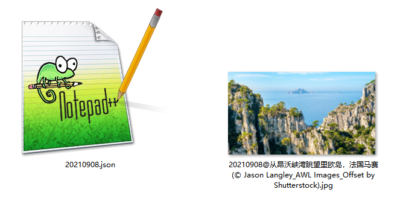
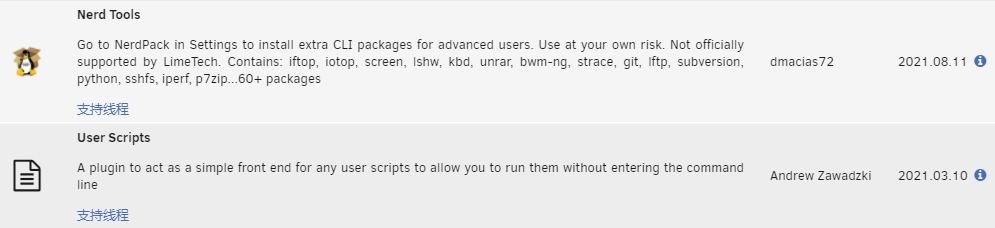
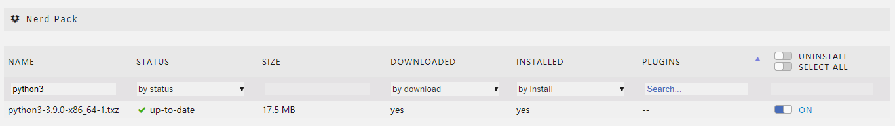
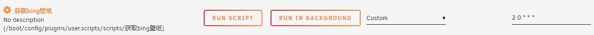

# 前言

最近 Fork 了一个使用  GitHub Action 自动抓取bing壁纸的项目

https://github.com/yfun-lab/bing-wallpaper


感觉项目的Python脚本写得十分优雅，按个人的习惯简单修改了脚本部署到自己的 GitHub 上。

同时顺手在本地 NAS 上也跑一个，供日常观赏。




# 1）安装所需的运行环境

首先于 unRAID  `Community Applications` 安装 **Nerd Tools** 和 **User Scripts** 两个插件



然后打开 **Nerd Tools** 安装 `Python3` 



至此所需的运行环境就部署完成了


# 2）运行脚本

保存为 `main.py` ，同时于同目录建一个 `Wallpaper` 文件夹用于存放下载来的文件

在终端使用 `python3 main.py` 测试脚本是否正常运作

```python
import urllib.request as req
import json
import re


url = 'http://cn.bing.com/HPImageArchive.aspx?format=js&idx=0&n=1&nc=1614319565639&pid=hp&FORM=BEHPTB&uhd=1&uhdwidth=3840&uhdheight=2160'

# try:
res = req.urlopen(url)
res = res.read().decode('utf-8')

api = json.loads(res)

api = api['images']
downloadURL = "https://bing.com" + api[0]['url']
dateTime = api[0]['enddate']
copyright = api[0]['copyright'] # 获取版权信息
rstr = r'[\/\\\:\*\?\"\<\>\|]'  # '/ \ : * ? " < > |'
new_copyright = re.sub(rstr, '_', copyright)  # 替换为下划线

req.urlretrieve(downloadURL, "./Wallpaper/{0}{1}{2}.jpg".format(dateTime, '@', new_copyright))
req.urlretrieve(url, "./Wallpaper/{}.json".format(dateTime))

# except:
#     print("Error.")
```

> 于原项目基础上修改了图片保存的目录与文件名（按 日期@版权信息 命名）
>
> 增加保存当日完整的 json 信息到本地，以供日后可能有用得上的时候


# 3）配置定时执行



到 **User Scripts** 插件内添加一个新脚本，内容按实际情况编辑

```bash
#!/bin/bash
cd /mnt/disk1/appdata/bing/ && python3 main.py
```

最后设置 [Cron](https://corntab.com/) 计划任务定时运行

 `2 0 * * *` 

>每日凌晨零点02分

