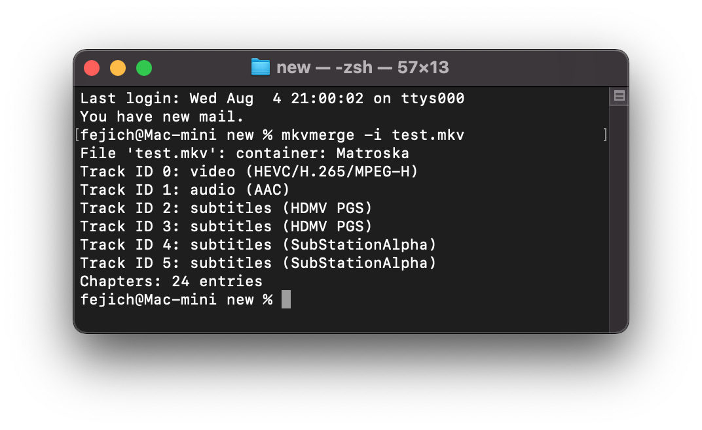

# 前言

一切起因是发现了 emby 这个媒体中心软件有个 “bug”

内嵌了 .ass字幕 的视频如果是 directplay 方式（直接播放）字幕能正确显示，

但是一旦触发了转码，字幕就得隔一分钟左右才能显示出来。

而造成这么慢的原因，是因为实时导出字幕这个操作比较耗时（目前我尝试过好几个软件都得实现不了秒出）

直接外挂的字幕就没这种烦恼，所以有了这个文章。


# 方法1 使用 mkvtoolnix 工具包

Mac 系统安装：`brew install mkvtoolnix` 

查看文件信息：`mkvmerge -i test.mkv`




可以看到 4 跟 5 是 ass 字幕

导出命令：`mkvextract tracks test.mkv 4:sub1.ass 5:sub2.ass`

>mkvextract 在 win 系统下还有个 GUI ，其他系统就老实用 CUI 吧


批量操作脚本

```sh
for file in *.mkv; do
    filename=${file%.*}
    mkvextract tracks "${file}" 4:"${filename}.map4.ass" 4:"${filename}.map5.ass"
done
```


# 方法2 使用 ffmpeg

查看文件信息：`ffmpeg -i test.mkv`

导出字幕：`ffmpeg -i test.mkv -map 0:5 sub.ass`
> ffmpeg 还可以给字幕转格式，例如 ass 转 srt。只要指定输出的格式就会自动处理


批量操作脚本

```sh
for file in *.mkv; do
    filename=${file%.*}
    ffmpeg -i "${file}" -map 0:2 "${filename}.map2.ass" -map 0:3 "${filename}.map3.ass" -map 0:4 "${filename}.map4.ass" -map 0:5 "${filename}.map5.ass"
done
```