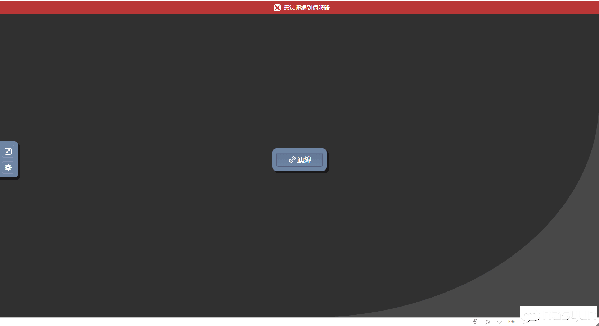
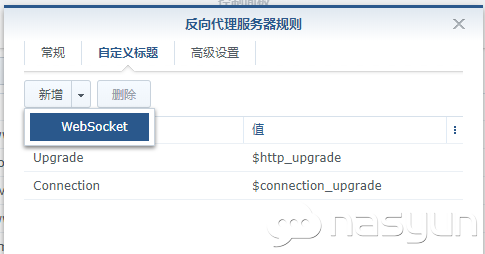

# 问题情况

群晖 `DSM 6.2.1`以上版本，在使用   反向代理用域名访问`虚拟机（Virtual Machine）`时标题为 noVNC 的网页 提示`“无法连线到伺服器”（Failed to connect to server）`。

看过之前大神的帖子让改 Portal.mustache 文件，但是在 DSM 6.2.1 及以上版本中这种改法不但不起作用，还会让 DSM 无法启动，请大家一定要注意。

# 解决办法

在 控制面板-应用程序门户-反向代理服务器 中选中要访问虚拟机的那条反向代理， 编辑-“自定义标题”选项卡-“新增”的下拉箭头-WebSocket，然后随便点一下新添加的 “Upgrade”或者“Connection”标签名称，确定保存即可。每个需要访问虚拟机的反代域名都要设置一遍才行。

# 转载整理自

[[解决使用反向代理域名访问群晖虚拟机时提示noVNC“无法连线到伺服器”的问题](http://www.nasyun.com/thread-70881-1-1.html)

+ 作者：`shenhaiyu` 于 2020-5-17 20:15 编辑
