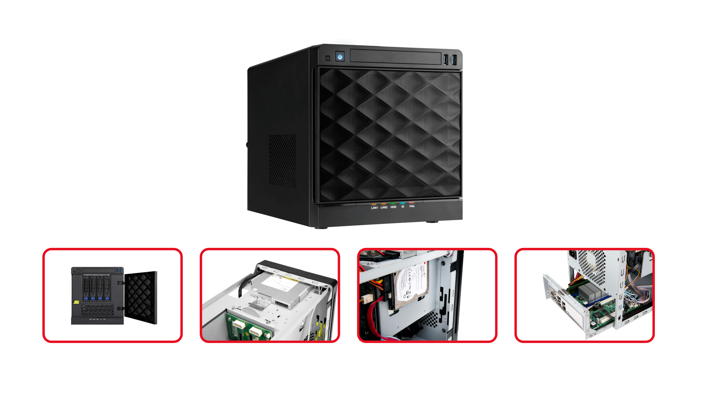
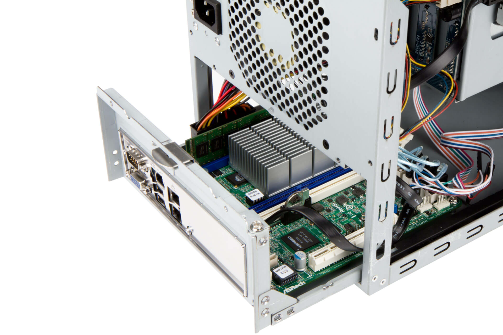
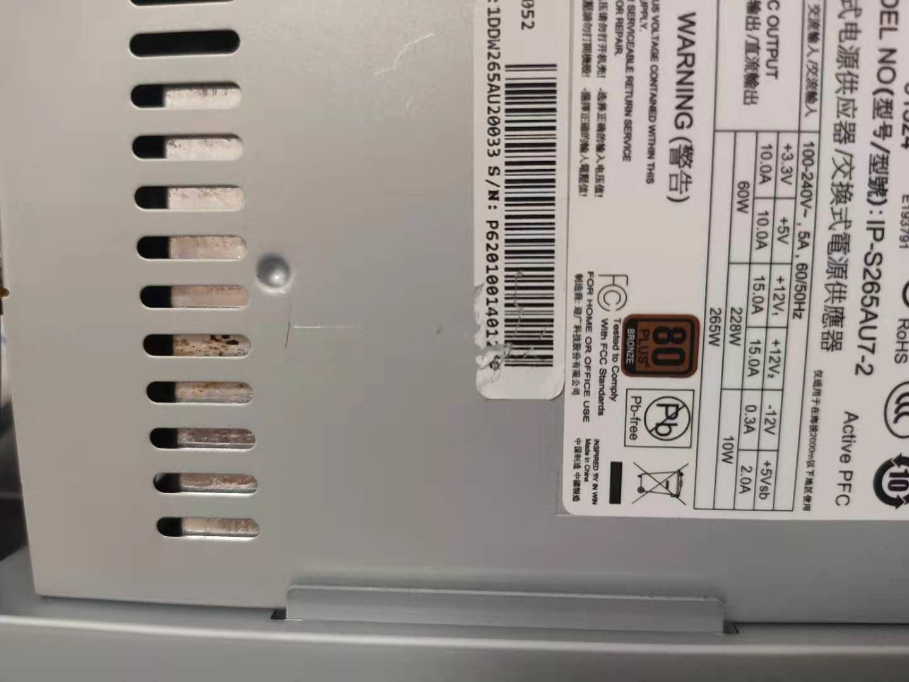
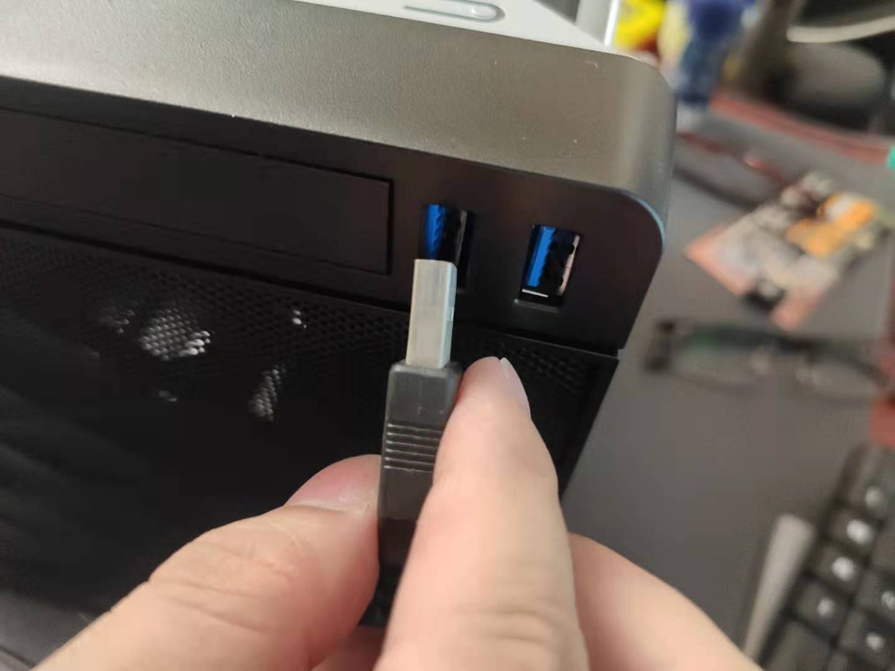

# 起因

更换机箱没有什么特别理由，仅仅是因为用得久了颜值下降还有厚厚的积灰难以清理.....

干脆就物色一只新的箱子，提升使用体验增加生活幸福感。

> 原本计划是双11再剁手的，不过好基友 shenhaiyu 得知后送了套 8Gx2 的内存助我升级硬件。我也就毫不犹豫的提前下单了:happy:

# 挑选

NAS 机箱相对小众，颜值高做工好还要设计合理的NAS机箱市面上能选的没几台。

+ 蜗牛星际那种垃圾佬专用矿箱直接略过
+ 万由出的两款没有明显缺陷，我原本就在用所以略过
+ 拓普龙这类工控机箱倒是便宜皮实，但是颜值有点不在线
+ 小作坊DIY做的机箱交货期久，做工没保证出问题翻车几率高
+ “大厂银欣”出的几款都是塑料硬盘托架，做工设计方面网上评价褒贬不一
+ 乔思伯N1直立式5盘位机箱有点长草，然而得抽出整个外壳才能换硬盘实在是个容易出状况的设计
+ mineNAS迈K1介绍说是超微设计国内代工生产，但是看淘宝买家发的评论图与超微官网有好些出入

挑来选去最终是买了 **IN WIN 迎广MS04 NAS机箱**。选这款最大的原因是其可拉出的主板托盘设计，这个为安装调试与日后维护提供了便利。

整体做工与颜值也符合我的要求，详细优点开箱网上已经有很多这里就不再重复了。

# 装机

淘宝选一家销量最高的授权代理商下单，全新机箱+原装电源 顺丰包邮 **总价：869**

2天时间顺丰小哥横跨大半个中国把机箱送到我手上，拿到后第一时间开箱检查却是发现翻了车 :joy:

说好的全新机箱倒是不假，但是里边的电源却是**生了锈**的。。。条码也被划花，明显就是使用过的

然后前置面板 USB 也是有状况，两个 USB 口都没对齐外壳，其中一只更是完全无法插进去。

万幸的是联系客服后，店铺处理很迅速承认过失并安排了替换。

我最后是决定把问题电源做退货处理，机箱留着。USB 口的问题客服承诺补偿50块红包，等有时间我再自行拆机看看能不能拨正位置。

其他方面倒是没遇到问题，使用旧机电源顺利完成装机。

> 实际使用一天后发现，机箱硬盘托板不能实时显示每只硬盘的读写状态。通电后只长亮蓝灯，读写时候没有其他提示实在是可惜。

# 最后记念下旧机箱

相册里边翻出 2015.05.13 号拍的万由4盘位NAS整机开箱，即使从今天来看这个做工跟设计都是很给力的。希望万由日后能设计出更出色的NAS机箱，让消费者可以有更多靠谱的NAS机箱选择。

